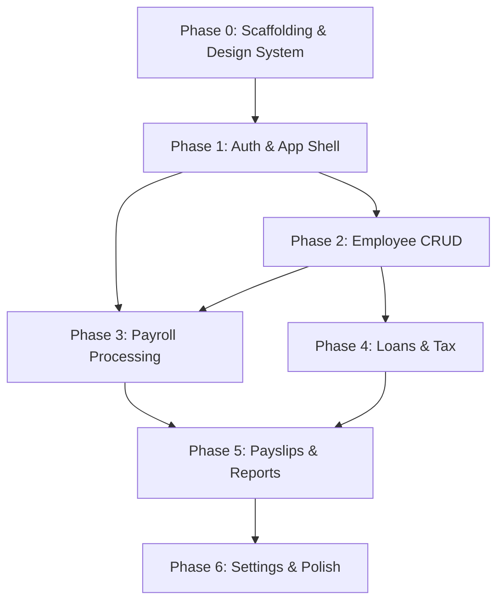

# Frontend Execution Plan — School Payroll System

A modular, phase-by-phase execution plan to build the Next.js frontend for the school payroll backend. Each phase produces a **shippable vertical slice** — every phase ends with something you can see and use.

> [!IMPORTANT]
> **Auth strategy decision**: The plan uses **httpOnly cookies via Next.js API route proxy** (not localStorage). This is the safer choice for a financial application. Confirm if this is acceptable.

> [!NOTE]
> **Next.js version**: The plan targets **Next.js 15** (latest stable), not 16 as originally written in FRONTEND_PLAN.md.

---

## Phase 0 — Project Scaffolding & Design System

**Goal**: Bootable project with design tokens, no business logic.

### 0.1 Project Init

#### [NEW] `frontend/` (project root)

- `npx -y create-next-app@latest ./ --typescript --tailwind --eslint --app --src-dir --import-alias "@/*"`
- Install deps:
  ```
  shadcn/ui init (with New York style, slate base, CSS variables)
  @tanstack/react-query, @tanstack/react-table
  zustand, axios, zod, react-hook-form, @hookform/resolvers
  recharts, date-fns, lucide-react
  ```

### 0.2 Design System & Shared Primitives

#### [NEW] [globals.css](file:///Users/amaku/IdeaProjects/payroll-payslips-loans/frontend/src/app/globals.css)

- CSS variables for color palette, spacing scale, typography
- Light + dark mode tokens
- Scrollbar, focus ring, and transition defaults

#### [NEW] shadcn/ui components (via CLI)

Install incrementally as needed. Starting set:
```
button, input, label, card, dialog, sheet, table,
dropdown-menu, select, badge, toast, skeleton,
tabs, separator, checkbox, form, popover, avatar,
command, scroll-area, tooltip
```

#### [NEW] [currency.ts](file:///Users/amaku/IdeaProjects/payroll-payslips-loans/frontend/src/lib/utils/currency.ts)

- `formatCurrency(amount, currencyCode?)` — renders `KES 50,000.00`
- `formatNegativeCurrency(amount)` — renders `(KES 1,000.00)` in red

#### [NEW] [dates.ts](file:///Users/amaku/IdeaProjects/payroll-payslips-loans/frontend/src/lib/utils/dates.ts)

- `formatDate`, `formatDateRange`, `relativeTime` using `date-fns`

#### [NEW] [enums.ts](file:///Users/amaku/IdeaProjects/payroll-payslips-loans/frontend/src/lib/types/enums.ts)

All enums mirrored 1:1 from the backend entities:

```typescript
// From employee.entity.ts
enum EmployeeGender { MALE, FEMALE, OTHER }
enum EmployeeStatus { ACTIVE, INACTIVE, TERMINATED }

// From salary.entity.ts
enum SalaryStatus { DRAFT, APPROVED, PAID, CANCELLED }

// From pay-period.entity.ts
enum PayPeriodStatus { OPEN, PROCESSING, CLOSED }

// From loan.entity.ts
enum LoanType { STANDARD_LOAN, SALARY_ADVANCE }
enum LoanStatus { PENDING, APPROVED, REJECTED, ACTIVE, FULLY_PAID, DEFAULTED, CANCELLED }

// From salary-detail.entity.ts
enum ComponentType { EARNING, DEDUCTION, TAX }

// From payslip.entity.ts
enum PayslipStatus { GENERATED, SENT, VIEWED, FAILED }
```

#### [NEW] [api.ts](file:///Users/amaku/IdeaProjects/payroll-payslips-loans/frontend/src/lib/types/api.ts)

TypeScript interfaces for every backend entity response shape — `Employee`, `Salary`, `SalaryDetail`, `PayPeriod`, `Loan`, `LoanRepayment`, `Payslip`, `TaxRule`, `TaxBracket`, `Department`, `Role`, `Permission`, `SalaryComponent`, `EmployeeSalaryComponent`, `EmployeeBankDetails`, `Country`, `PayrollSettings`, `Tenant`, `User`.

Also: `PaginatedResponse<T>`, `ApiError`, `AuthResponse`.

#### [NEW] Common UI components

| Component | File | Purpose |
|-----------|------|---------|
| `StatusBadge` | `components/common/status-badge.tsx` | Color-coded badge from enum → color map |
| `StatCard` | `components/common/stat-card.tsx` | KPI card (number + label + trend arrow) |
| `CurrencyDisplay` | `components/common/currency-display.tsx` | Formatted money display component |
| `ConfirmDialog` | `components/common/confirm-dialog.tsx` | Reusable "Are you sure?" dialog |
| `EmptyState` | `components/common/empty-state.tsx` | Icon + message + CTA for empty lists |
| `LoadingSkeleton` | `components/common/loading-skeleton.tsx` | Configurable skeleton shapes |
| `DataTable` | `components/common/data-table.tsx` | TanStack Table wrapper with search, filter, pagination, row selection, bulk actions |

---

## Phase 1 — Auth & App Shell

**Goal**: User can register a school, log in, see a sidebar, and navigate. No data pages yet.

### 1.1 API Client

#### [NEW] [client.ts](file:///Users/amaku/IdeaProjects/payroll-payslips-loans/frontend/src/lib/api/client.ts)

- Axios instance: `baseURL = process.env.NEXT_PUBLIC_API_URL || 'http://localhost:3000/api'`
- Request interceptor: attach `Authorization: Bearer <token>`
- Response interceptor: unwrap `response.data`, handle 401 → redirect `/login`, handle 403 → toast "Insufficient permissions"
- Global error formatter → `ApiError` type

### 1.2 Auth

#### [NEW] [auth.ts](file:///Users/amaku/IdeaProjects/payroll-payslips-loans/frontend/src/lib/api/auth.ts)

API calls: `login(email, password)`, `register(RegisterDto)`, `getCurrentUser()`

#### [NEW] [auth-store.ts](file:///Users/amaku/IdeaProjects/payroll-payslips-loans/frontend/src/stores/auth-store.ts)

Zustand store:
```typescript
{
  user: User | null,
  token: string | null,
  isAuthenticated: boolean,
  login(email, password): Promise<void>,
  register(dto): Promise<void>,
  logout(): void,
  hasRole(roles: string[]): boolean,
}
```

#### [NEW] [use-auth.ts](file:///Users/amaku/IdeaProjects/payroll-payslips-loans/frontend/src/lib/hooks/use-auth.ts)

Hook wrapping the Zustand store for use in components.

#### [NEW] [middleware.ts](file:///Users/amaku/IdeaProjects/payroll-payslips-loans/frontend/src/middleware.ts)

Next.js middleware: check for auth token, redirect unauthenticated users to `/login`, redirect authenticated users from `/login` to `/`.

### 1.3 Auth Pages

#### [NEW] [login/page.tsx](file:///Users/amaku/IdeaProjects/payroll-payslips-loans/frontend/src/app/(auth)/login/page.tsx)

- Email + password form (React Hook Form + Zod)
- Error feedback (invalid credentials, account inactive)
- "Register your school" link
- Redirect to dashboard on success

#### [NEW] [register/page.tsx](file:///Users/amaku/IdeaProjects/payroll-payslips-loans/frontend/src/app/(auth)/register/page.tsx)

- Fields: `schoolName`, `firstName`, `lastName`, `email`, `password` (mirrors `RegisterDto`)
- Auto-login after success, redirect to dashboard

#### [NEW] [(auth)/layout.tsx](file:///Users/amaku/IdeaProjects/payroll-payslips-loans/frontend/src/app/(auth)/layout.tsx)

- Centered card layout, no sidebar
- School logo/branding area

### 1.4 Dashboard Shell

#### [NEW] [(dashboard)/layout.tsx](file:///Users/amaku/IdeaProjects/payroll-payslips-loans/frontend/src/app/(dashboard)/layout.tsx)

- Auth check (redirect to `/login` if unauthenticated)
- Sidebar + topbar + main content area
- TanStack Query `QueryClientProvider` wrapping

#### [NEW] [sidebar.tsx](file:///Users/amaku/IdeaProjects/payroll-payslips-loans/frontend/src/components/layout/sidebar.tsx)

- Navigation items filtered by `user.systemRoles`
- Collapsible (icon-only on small screens)
- Active route highlighting
- Menu items: Dashboard, Employees, Departments, Roles, Payroll, Loans, Tax, Payslips, Reports, Settings

#### [NEW] [topbar.tsx](file:///Users/amaku/IdeaProjects/payroll-payslips-loans/frontend/src/components/layout/topbar.tsx)

- Tenant/school name display
- User avatar dropdown (profile, logout)
- Breadcrumbs
- Mobile hamburger menu toggle

#### [NEW] [ui-store.ts](file:///Users/amaku/IdeaProjects/payroll-payslips-loans/frontend/src/stores/ui-store.ts)

Zustand: `sidebarCollapsed`, `theme` (light/dark), `mobileSidebarOpen`.

---

## Phase 2 — Employee Management (First CRUD Module)

**Goal**: Full employee CRUD. This phase establishes the reusable patterns (DataTable, forms, API hooks) that all subsequent modules copy.

### 2.1 API & Hooks

#### [NEW] [employees.ts](file:///Users/amaku/IdeaProjects/payroll-payslips-loans/frontend/src/lib/api/employees.ts)

All employee API calls: `list(filters)`, `getById(id)`, `create(dto)`, `update(id, dto)`, `delete(id)`

#### [NEW] [departments.ts](file:///Users/amaku/IdeaProjects/payroll-payslips-loans/frontend/src/lib/api/departments.ts)

CRUD for departments.

#### [NEW] [roles.ts](file:///Users/amaku/IdeaProjects/payroll-payslips-loans/frontend/src/lib/api/roles.ts)

CRUD for roles + permissions.

#### [NEW] [salary-components.ts](file:///Users/amaku/IdeaProjects/payroll-payslips-loans/frontend/src/lib/api/salary-components.ts)

CRUD for salary components + employee salary component overrides.

#### [NEW] [use-employees.ts](file:///Users/amaku/IdeaProjects/payroll-payslips-loans/frontend/src/lib/hooks/use-employees.ts)

TanStack Query hooks: `useEmployees`, `useEmployee`, `useCreateEmployee`, `useUpdateEmployee`, `useDeleteEmployee`.

#### [NEW] [validation.ts](file:///Users/amaku/IdeaProjects/payroll-payslips-loans/frontend/src/lib/utils/validation.ts)

Zod schemas mirroring backend DTOs: `createEmployeeSchema`, `updateEmployeeSchema`, `createDepartmentSchema`, `createRoleSchema`, `createSalaryComponentSchema`, `createBankDetailsSchema`.

### 2.2 Employee Pages

#### [NEW] [employees/page.tsx](file:///Users/amaku/IdeaProjects/payroll-payslips-loans/frontend/src/app/(dashboard)/employees/page.tsx)

- DataTable: Employee #, Name, Department, Role, Status, Join Date, Actions
- Filters: status dropdown, department dropdown, name search
- Row actions: View, Edit, Deactivate

#### [NEW] [employees/[id]/page.tsx](file:///Users/amaku/IdeaProjects/payroll-payslips-loans/frontend/src/app/(dashboard)/employees/[id]/page.tsx)

Tabbed layout:
- **Overview**: personal info, role, department, status
- **Salary Components**: assigned components table with add/edit/deactivate
- **Bank Details**: bank accounts list with default indicator, add/edit/remove
- **Payroll History**: past salaries for this employee (populated in Phase 3)
- **Loans**: active and past loans (populated in Phase 4)

#### [NEW] [employees/new/page.tsx](file:///Users/amaku/IdeaProjects/payroll-payslips-loans/frontend/src/app/(dashboard)/employees/new/page.tsx)

- Multi-section form: Personal Info, Employment Info, Contact
- Dropdowns populated from roles, departments, countries APIs
- Zod validation mirroring `CreateEmployeeDto`

### 2.3 Organization Pages

#### [NEW] [departments/page.tsx](file:///Users/amaku/IdeaProjects/payroll-payslips-loans/frontend/src/app/(dashboard)/departments/page.tsx)

- Simple CRUD table with modal create/edit (no separate page)
- Inline activate/deactivate toggle

#### [NEW] [roles/page.tsx](file:///Users/amaku/IdeaProjects/payroll-payslips-loans/frontend/src/app/(dashboard)/roles/page.tsx)

- Roles table with expandable permission rows
- Create role dialog with permission checkboxes

---

## Phase 3 — Payroll Processing (Core Workflow)

**Goal**: Full payroll cycle — create period → process → review → approve → pay. This is the most complex and most critical phase.

### 3.1 API & Hooks

#### [NEW] [payroll.ts](file:///Users/amaku/IdeaProjects/payroll-payslips-loans/frontend/src/lib/api/payroll.ts)

API calls:
- Pay periods: `listPayPeriods(filters)`, `getPayPeriod(id)`, `createPayPeriod(dto)`, `closePayPeriod(id)`
- Payroll: `processPayroll(dto)`, `listSalaries(filters)`, `getSalary(id)`, `approveSalary(id, dto)`, `paySalary(id, dto)`, `bulkPayment(dto)`

#### [NEW] [use-payroll.ts](file:///Users/amaku/IdeaProjects/payroll-payslips-loans/frontend/src/lib/hooks/use-payroll.ts)

TanStack Query hooks: `usePayPeriods`, `usePayPeriod`, `useSalaries`, `useSalary`, `useProcessPayroll`, `useApproveSalary`, `usePaySalary`, `useBulkPayment`.

### 3.2 Payroll Pages

#### [NEW] [payroll/page.tsx](file:///Users/amaku/IdeaProjects/payroll-payslips-loans/frontend/src/app/(dashboard)/payroll/page.tsx)

- Pay periods DataTable: Name, Start Date, End Date, Payment Date, Status, Actions
- Status badges: OPEN (blue), PROCESSING (yellow), CLOSED (green)
- Create Pay Period dialog
- Row actions: "Process Payroll" (OPEN), "View Salaries" (PROCESSING/CLOSED)

#### [NEW] [payroll/[payPeriodId]/page.tsx](file:///Users/amaku/IdeaProjects/payroll-payslips-loans/frontend/src/app/(dashboard)/payroll/[payPeriodId]/page.tsx)

Payroll processing workspace:
- Period info card (status, dates, action buttons)
- Salary DataTable: Employee, Gross, Deductions, Net, Status, Actions
- Bulk actions toolbar (approve selected, pay selected)
- Buttons: Process Payroll, Approve All, Bulk Payment, Generate Payslips, Email Payslips

#### [NEW] [process-payroll-dialog.tsx](file:///Users/amaku/IdeaProjects/payroll-payslips-loans/frontend/src/components/payroll/process-payroll-dialog.tsx)

Wizard dialog:
1. Confirmation with period name
2. Dry run checkbox
3. Progress indicator
4. Result summary: "X salaries processed, Y errors" with expandable error list

#### [NEW] [salary-detail-sheet.tsx](file:///Users/amaku/IdeaProjects/payroll-payslips-loans/frontend/src/components/payroll/salary-detail-sheet.tsx)

Slide-over sheet showing:
- Employee info header
- Earnings table (component name, calculation note, amount) — filtered by `ComponentType.EARNING`
- Deductions table — filtered by `ComponentType.DEDUCTION` and `ComponentType.TAX`
- Summary: Gross, Total Deductions, Net
- Action buttons: Approve (if DRAFT), Pay (if APPROVED)

---

## Phase 4 — Loans & Tax

**Goal**: Loan lifecycle (apply → approve → disburse → repay) and tax rule management.

### 4.1 API & Hooks

#### [NEW] [loans.ts](file:///Users/amaku/IdeaProjects/payroll-payslips-loans/frontend/src/lib/api/loans.ts)

API calls: `listLoans(filters)`, `getLoan(id)`, `createLoan(dto)`, `createAdvance(dto)`, `approveLoan(id, dto)`, `rejectLoan(id, dto)`, `disburseLoan(id)`, `getLoanRepayments(id)`, `getEmployeeLoans(employeeId)`

#### [NEW] [tax.ts](file:///Users/amaku/IdeaProjects/payroll-payslips-loans/frontend/src/lib/api/tax.ts)

API calls: `listTaxRules()`, `getTaxRule(id)`, `createTaxRule(dto)`, `updateTaxRule(id, dto)`, `deleteTaxRule(id)`

#### [NEW] [use-loans.ts](file:///Users/amaku/IdeaProjects/payroll-payslips-loans/frontend/src/lib/hooks/use-loans.ts)

TanStack Query hooks for all loan operations.

### 4.2 Loan Pages

#### [NEW] [loans/page.tsx](file:///Users/amaku/IdeaProjects/payroll-payslips-loans/frontend/src/app/(dashboard)/loans/page.tsx)

- DataTable: Employee, Type, Amount, Outstanding, Monthly Payment, Status, Applied Date
- Filters: status, type, employee search
- Color-coded status badges

#### [NEW] [loans/[id]/page.tsx](file:///Users/amaku/IdeaProjects/payroll-payslips-loans/frontend/src/app/(dashboard)/loans/[id]/page.tsx)

- Loan info card (type, amount, interest, term, total repayable, outstanding, status)
- Visual progress bar: amount repaid vs total
- Action buttons: Approve/Reject (PENDING), Disburse (APPROVED)
- Repayment history table: Date, Amount, Principal, Interest, Balance After

#### [NEW] [loans/apply/page.tsx](file:///Users/amaku/IdeaProjects/payroll-payslips-loans/frontend/src/app/(dashboard)/loans/apply/page.tsx)

- Employee dropdown, Loan Type toggle (Standard / Salary Advance)
- Standard: Amount, Interest Rate, Term, Reason
- Salary Advance: Amount, Reason (simplified)
- **Live calculation preview**: monthly repayment + total repayable updates as user types

### 4.3 Tax Page

#### [NEW] [tax/page.tsx](file:///Users/amaku/IdeaProjects/payroll-payslips-loans/frontend/src/app/(dashboard)/tax/page.tsx)

- Tax rules DataTable: Name, Type, Rate/Value, Effective From/To, Default, Actions
- Create/Edit dialog with conditional fields based on type
- Progressive tax: inline editable bracket table (min, max, rate, fixed amount) with add/remove row buttons

---

## Phase 5 — Payslips & Reports

**Goal**: Generate/email payslips, view all 5 report types with charts and export.

### 5.1 API & Hooks

#### [NEW] [payslips.ts](file:///Users/amaku/IdeaProjects/payroll-payslips-loans/frontend/src/lib/api/payslips.ts)

API calls: `generatePayslip(salaryId)`, `bulkGenerate(payPeriodId)`, `sendPayslip(id)`, `bulkSend(payPeriodId)`, `downloadPayslip(accessToken)`, `getEmployeePayslips(employeeId)`, `getPayPeriodPayslips(payPeriodId)`, `getPayslip(id)`

#### [NEW] [reports.ts](file:///Users/amaku/IdeaProjects/payroll-payslips-loans/frontend/src/lib/api/reports.ts)

API calls: `monthlySummary(filters)`, `taxSummary(filters)`, `loanPortfolio()`, `departmentCost(filters)`, `yearEnd(filters)`, `exportCsv(filters)`, `exportExcel(filters)`

#### [NEW] [use-reports.ts](file:///Users/amaku/IdeaProjects/payroll-payslips-loans/frontend/src/lib/hooks/use-reports.ts)

TanStack Query hooks for all report endpoints.

### 5.2 Payslip Page

#### [NEW] [payslips/page.tsx](file:///Users/amaku/IdeaProjects/payroll-payslips-loans/frontend/src/app/(dashboard)/payslips/page.tsx)

- Filter by: Pay Period dropdown, Employee search
- DataTable: Employee, Pay Period, Status, Generated At, Sent At, Actions
- Actions: Download PDF (opens `GET /payslips/download/:accessToken`), Send Email, View
- Bulk actions: Generate All (for selected period), Email All

### 5.3 Reports Page

#### [NEW] [reports/page.tsx](file:///Users/amaku/IdeaProjects/payroll-payslips-loans/frontend/src/app/(dashboard)/reports/page.tsx)

Dashboard-style page with 5 report cards, each expandable to full view:

1. **Monthly Summary** — date picker → stat cards (employees, gross, deductions, net, tax) + employee breakdown table + CSV/Excel export
2. **Tax Summary** — year picker → monthly bar chart + total annual tax + export
3. **Loan Portfolio** — pie chart (by status) + bar chart (by type) + KPIs + export
4. **Department Cost** — month/year picker → horizontal bar chart + table (department, employees, gross, net, avg) + export
5. **Year-End** — year picker → 12-month trend line chart + combined summary + Excel export

---

## Phase 6 — Settings, Polish & Error Handling

**Goal**: System settings, responsive design, error boundaries, dark mode, performance.

### 6.1 Settings

#### [NEW] [settings/page.tsx](file:///Users/amaku/IdeaProjects/payroll-payslips-loans/frontend/src/app/(dashboard)/settings/page.tsx)

Tabbed layout:
- **System Settings**: key-value table with inline editing, type indicator
- **Countries**: CRUD table (Name, Code, Currency Code, Currency Symbol, Active)

#### [NEW] [settings.ts](file:///Users/amaku/IdeaProjects/payroll-payslips-loans/frontend/src/lib/api/settings.ts) + [countries.ts](file:///Users/amaku/IdeaProjects/payroll-payslips-loans/frontend/src/lib/api/countries.ts)

API calls for settings and countries.

### 6.2 Polish

- **Error boundaries**: Wrap each route segment in an `error.tsx` with graceful fallback UI
- **Loading states**: Add `loading.tsx` skeletons to every route group
- **Responsive pass**: sidebar collapse, card-based mobile tables, full-screen mobile sheets
- **Dark mode**: toggle in topbar, persisted in `ui-store`
- **Keyboard shortcuts**: `Cmd+K` search, `Esc` to close dialogs
- **Performance**: lazy loading heavy components (charts, tables), route-level code splitting (built-in with App Router)

---

## File Dependency Graph

The build order is designed so each phase only depends on work from previous phases:



## Module Boundaries

Each feature module follows the same structure for maximum consistency:

```
Feature Module
├── lib/api/<module>.ts          ← Raw API calls (thin Axios wrappers)
├── lib/hooks/use-<module>.ts    ← TanStack Query hooks (cache, mutations)
├── lib/utils/validation.ts      ← Zod schemas (shared file, grouped by module)
├── components/<module>/          ← Module-specific UI components
└── app/(dashboard)/<module>/     ← Route pages (compose components + hooks)
```

**Rules**:
- API files **never** import from components or pages
- Hooks **never** import from components or pages
- Components **may** import from hooks and lib/utils
- Pages **may** import from everything
- Common components **never** import from feature modules

## Verification Plan

### Automated Tests

Since this is a greenfield frontend project, verification will primarily be visual + functional:

1. **Build check**: `npm run build` must pass with zero errors after each phase
2. **Lint check**: `npm run lint` must pass after each phase
3. **Type check**: `npx tsc --noEmit` must pass after each phase

### Manual / Browser Verification (per phase)

| Phase | What to verify |
|-------|---------------|
| 0 | Project boots with `npm run dev`, blank page renders, shadcn components imported |
| 1 | Register flow creates a school + logs in, login works, sidebar renders, unauthenticated users redirect to `/login` |
| 2 | Create employee → appears in list, edit employee → changes persist, filter/search works, delete works |
| 3 | Create pay period → process payroll → salaries appear → approve → mark paid. Verify salary detail slide-over shows correct earnings/deductions |
| 4 | Create loan → approve → disburse → verify repayment history. Create tax rule with progressive brackets |
| 5 | Generate payslip for a paid salary → download PDF works. Reports page shows charts with real data |
| 6 | Toggle dark mode, resize to mobile, verify sidebar collapses, tables become cards, error boundaries display gracefully |

> [!TIP]
> Run the backend locally (`npm run start:dev` in `backend/school-payroll-system/`) and seed it (`npm run seed`) before testing any phase beyond Phase 0.
